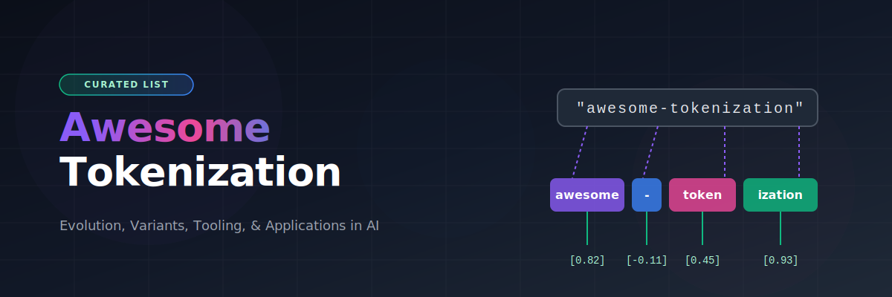
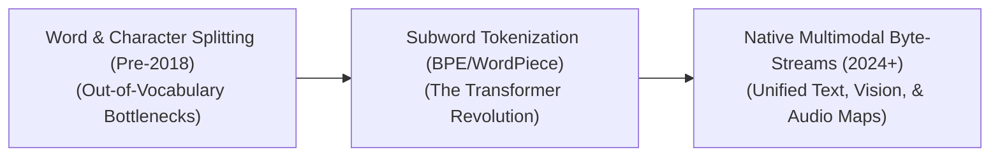

# Awesome-Tokenization 🪙

  

    

  

## 📌 Tokenization in AI: Evolution, Variants, Types, & Applications

Tokenization is the foundational preprocessing step in **Artificial Intelligence (AI)**, **Machine Learning (ML)**, and **Natural Language Processing (NLP)**. It converts raw, continuous strings of text, programming code, or multimodal data bytes into discrete, structural units called **"tokens."** These tokens are mapped to numerical indices within a fixed vocabulary matrix, allowing mathematical neural network layers (like Transformers) to process human communication. 

Over the history of AI, tokenization has evolved from simple punctuation-splitting rules to complex, data-driven subword compression algorithms (like BPE, WordPiece, and SentencePiece) and unified multimodal byte streams. This repository acts as a curated catalog of the evolution, tooling, challenges, and applications of tokenization.

---

## 1. ⏳ The Chronological Evolution

The technical progression of tokenization reflects a constant push away from rigid, language-dependent grammatical rules toward statistical, language-agnostic data compression systems.

| Era | Year First Used | First Used Paper | Description & Impacts |
| :--- | :--- | :--- | :--- |
| [**Word & Character Splitting Era**](details/word-character-splitting.md) (Traditional NLP, Pre-2018) | 1993 | [Marcus et al. (1993)](https://dl.acm.org/doi/10.1162/coli.1993.19.2.313) | **Concept:** Models relied on rule-based regular expressions (like splitting text on spaces and punctuation symbols) or single-character pipelines.  **Limitation:** Word tokenizers suffered from the severe **Out-of-Vocabulary (OOV)** crisis, where unseen words (like typos or technical terms) were mapped to a generic `[UNK]` token, destroying context. Character tokenizers solved OOV but created massive sequence lengths that stalled recurrent model processing. |
| [**Subword Compression Era**](details/subword-compression.md) (The Transformer Rise, ~2018–2024) | 2015 | [Sennrich et al. (2015)](https://arxiv.org/abs/1508.07909) | **Concept:** Popularized by algorithms like **BPE**, **WordPiece**, and **SentencePiece**. Instead of words or individual characters, text is statistically compressed into frequent subword fragments (morphemes, prefixes, suffixes).  **Significance:** Fully resolved the OOV dilemma. Common words (like `the`) map to a single token, while unknown or complex terms (like `microarchitectural`) gracefully decompose into digestible subword blocks (`micro`, `architect`, `ural`). |
| [**Native Multimodal Byte Era**](details/native-multimodal-byte.md) (~2024–Present) | 2023 | [Yu et al. (2023)](https://arxiv.org/abs/2305.07185) | **Concept:** Pioneered by modern frontier architectures like Gemini, GPT-4o, and DeepSeek. It drops text-only limits by migrating to **Byte-Level BPE (BBPE)** or raw byte processing, mapping text characters, visual image patch coordinate arrays, and acoustic audio waves into a single, unified mathematical token space natively. |

---

## 2. 🧠 Core Functional & Subword Variants

Subword tokenization is dominated by three major statistical algorithms, each processing sequence aggregation and vocabulary boundaries differently.

| Algorithm | Year First Used | First Used Paper | Mechanism | Examples |
| :--- | :--- | :--- | :--- | :--- |
| [**Byte-Pair Encoding (BPE)**](details/byte-pair-encoding.md) | 1994 (Compression) 2015 (NLP) | [Gage (1994)](https://www.cs.princeton.edu/courses/archive/spr10/cos226/lectures/18Compression.pdf) [Sennrich et al. (2015)](https://arxiv.org/abs/1508.07909) | A bottom-up, iterative compression algorithm. It starts with a base vocabulary of single characters or bytes and continuously merges the most frequently adjacent token pairs in the training corpus until it hits a pre-defined vocabulary size. | GPT series (`tiktoken`), Claude, and Llama series. |
| [**WordPiece**](details/wordpiece.md) | 2012 | [Schuster & Nakajima (2012)](https://ieeexplore.ieee.org/document/6289079) | Similar to BPE, but modifies the merging metric. Instead of picking the absolute most frequent pair, it selects the token pair that maximizes the statistical likelihood of the training data according to a unigram language model. | BERT and DistilBERT. |
| [**Unigram Language Model Tokenization**](details/unigram-tokenization.md) | 2018 | [Kudo (2018)](https://arxiv.org/abs/1804.10959) | A top-down subtraction algorithm. It initializes with a massive vocabulary containing full words and complex phrases, recursively deleting the least useful, lowest-probability tokens until it shrinks down to the target vocabulary size. | T5 and XLNet. |

---

## 3. 🛠️ Implementation Frameworks & Tooling Types

Depending on the engine abstraction layer and operational requirements, AI systems deploy tokenizers using distinct architecture configurations.

| Framework / Tooling | Year First Used | First Used Paper / Source | Profile | Pros / Details |
| :--- | :--- | :--- | :--- | :--- |
| [**SentencePiece**](details/sentencepiece.md) (Language-Independent) | 2018 | [Kudo & Richardson (2018)](https://arxiv.org/abs/1808.06226) | An open-source encoder framework that treats input strings as a raw, continuous byte stream, handling spaces as a native visible character (represented by a structural block token `_`). | Bypasses the need for custom, language-specific pre-tokenizers, making it highly reproducible for languages that do not use whitespace boundaries (such as Chinese, Japanese, or Thai). |
| [**Tiktoken**](details/tiktoken.md) (High-Throughput Regex BBPE) | 2022 | [OpenAI (2022)](https://github.com/openai/tiktoken) | OpenAI's highly optimized, multi-threaded C++ implementation of Byte-Level BPE. It uses strict, handcrafted regular expressions to prevent the model from merging spaces, numbers, or punctuation awkwardly across distinct semantic code lines. | Highly optimized, BPE-focused library matched to OpenAI models. |
| [**Hugging Face Fast Tokenizers**](details/huggingface-fast-tokenizers.md) | 2019 | [Hugging Face (2019)](https://github.com/huggingface/tokenizers) | High-performance, Rust-backed tokenization pipelines that execute data encoding, decoding, and special token masking with zero Python GIL overhead during massive dataset pre-training sweeps. | Provides high-speed serialization with Rust, avoiding GIL bottlenecks. |

---

## 4. ⚡ Production Engineering Challenges & Mitigations

Deploying and scaling tokenization profiles inside live production pipelines introduces severe memory, prompt budget, and computational efficiency constraints.

| Challenge | Year First Analyzed | Analysis / Mitigation Paper | The Bottleneck | Mitigation |
| :--- | :--- | :--- | :--- | :--- |
| [**The Multilingual Token Tax**](details/multilingual-token-tax.md) | 2023 | [Petrov et al. (2023)](https://aclanthology.org/2023.emnlp-main.243/) | Because early subword tokenizers were trained heavily on English-dominant data corpuses, their vocabularies lack high-frequency representations for non-English scripts. As a result, a single word in languages like Hindi, Arabic, or Korean can fragment into 5 to 8 separate tokens, inflating API operational costs and filling up context windows prematurely for global users. | Scaling up modern **Vocabulary Sizes** (e.g., expanding from Llama-2's 32k vocabulary to Llama-3's 128k vocabulary or DeepSeek's 100k+ arrays) to allocate dedicated, native single-token slots for diverse international words. |
| [**The Number & Code Fragmentation Bug**](details/number-code-fragmentation.md) | 2019 | [Radford et al. (2019)](https://d4mucfpruywqi.cloudfront.net/better-language-models/language_models_are_unsupervised_multitask_learners.pdf) | Basic tokenizers split numbers unpredictably (e.g., `10000` could tokenise as `10` + `000`), which completely disrupts a model's architectural ability to learn positional math logic or interpret spacing indentation structures inside Python scripts. | Injecting strict pre-tokenization regular expression filters that force the system to isolate single numerical digits (`1` + `0` + `0` + `0` + `0`) or treat consecutive code indentation spaces as distinct block variables. |

---

## 5. 🌐 Modern Cross-Domain Applications

| Application | Year First Used | First Used Paper | Application Details |
| :--- | :--- | :--- | :--- |
| [**Autoregressive LLM Sequence Alignment**](details/autoregressive-sequence-alignment.md) | 2017 | [Vaswani et al. (2017)](https://arxiv.org/abs/1706.03762) | Acts as the entry and exit terminal layer for LLM servers. Text inputs are serialized into numerical arrays before entering self-attention blocks, and output probabilities are de-serialized back into human-readable characters during generative sampling. |
| [**Abstract Syntax Tree (AST) Source Code Processing**](details/ast-source-code-processing.md) | 2020 | [Feng et al. (2020)](https://arxiv.org/abs/2002.08155) | Powers code generation engines. Specialized tokenizers preserve formatting primitives, indentation tabs (`\t`), and programming keywords (`def`, `async`, `try`), preventing code loops from corrupting during structural text compression phases. |
| [**Bioinformatics & Peptide Chain Ingestion**](details/bioinformatics-peptide-chain.md) | 2020 | [Elnaggar et al. (2020)](https://arxiv.org/abs/2007.06225) | Maps genomic and macromolecular sequences. Subword BPE logic is applied to raw strings of amino acids (A, C, G, T) or complex protein sequences, compressing frequent chemical motifs into higher-order structural tokens to track biological mutations efficiently. |

