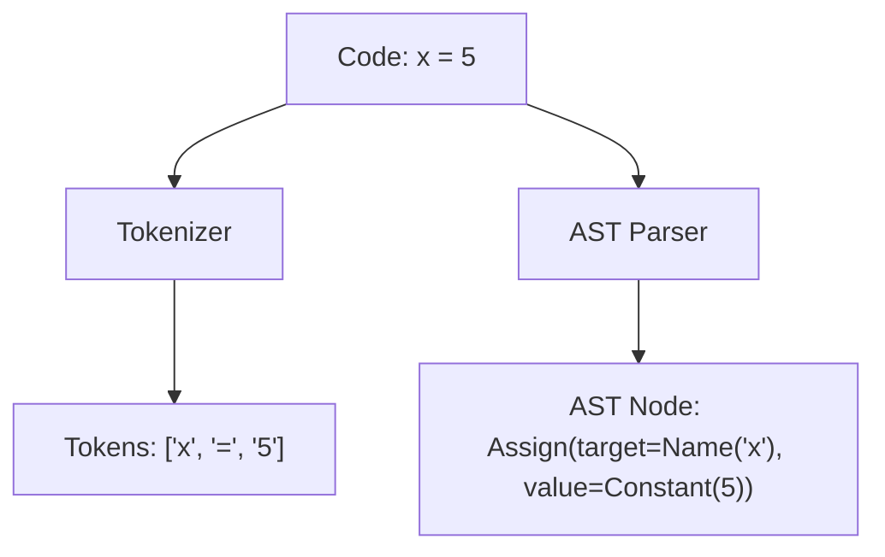

# Abstract Syntax Tree (AST) Source Code Processing\n\n### Overview
Unlike natural language, programming languages are structural. Tokenization for code must preserve syntax boundaries, keywords, and structural representations like Abstract Syntax Trees (ASTs).

### Key Concepts
* **Syntax-Aware Tokenizers**: Preserve code tabs, space sequences, and keywords.
* **AST Integration**: Parsing source code into an AST hierarchy and representing AST nodes as structural tokens for neural processing (e.g., GraphCodeBERT).

### Diagram: Code Tokenization vs Parsing

### Back-link
[← Back to README](../README.md)
