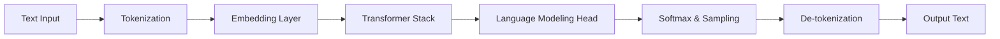

# Autoregressive LLM Sequence Alignment\n\n### Overview
Tokenization acts as the gateway to Transformer models, mapping text into indices for the embedding layers, and converting model output logits back into human-readable characters.

### Process
1. Input text is tokenized into IDs.
2. IDs are mapped to embedding vectors.
3. Transformer layers process vectors.
4. Output head maps vectors to vocabulary logits.
5. Softmax/Sampling selects the next token ID.
6. The selected ID is decoded back to text.

### Diagram: Auto-Regressive Gateway

### Back-link
[← Back to README](../README.md)
