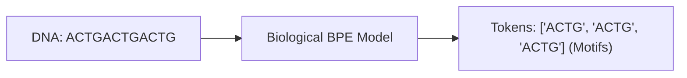

# Bioinformatics & Peptide Chain Ingestion\n\n### Overview
In Bioinformatics, DNA, RNA, and protein sequences are represented as character strings. Subword tokenization (such as BPE) is used to find biological motifs and compress long sequences.

### Key Concepts
* **Protein Tokenization**: Compressing peptide sequences (amino acid letters) into high-frequency biological motifs.
* **DNA Codon Tokenization**: Splitting nucleotides (A, C, T, G) into codons (triplets) or variable-length BPE tokens (evoBPE).

### Diagram: Biological Sequence Tokenization

### Back-link
[← Back to README](../README.md)
