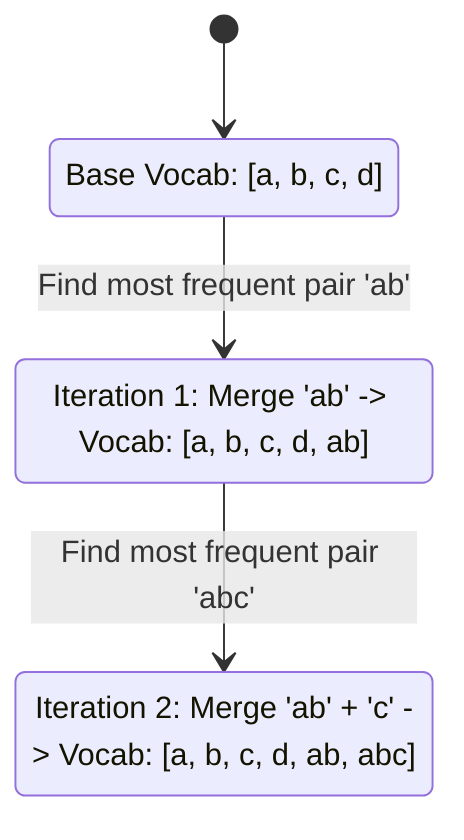

# Byte-Pair Encoding (BPE)\n\n### Overview
Byte-Pair Encoding (BPE) is a bottom-up subword tokenization algorithm originally designed for data compression. In NLP, BPE builds a vocabulary of frequent characters and character combinations.

### Algorithmic Steps
1. Initialize the vocabulary with all unique base characters/bytes in the training corpus.
2. Tokenize the corpus at the character level.
3. Count the frequency of all adjacent token pairs in the corpus.
4. Merge the most frequent pair and add it to the vocabulary.
5. Repeat steps 3–4 until the target vocabulary size is reached.

### Diagram: BPE Merging Process

### Back-link
[← Back to README](../README.md)
