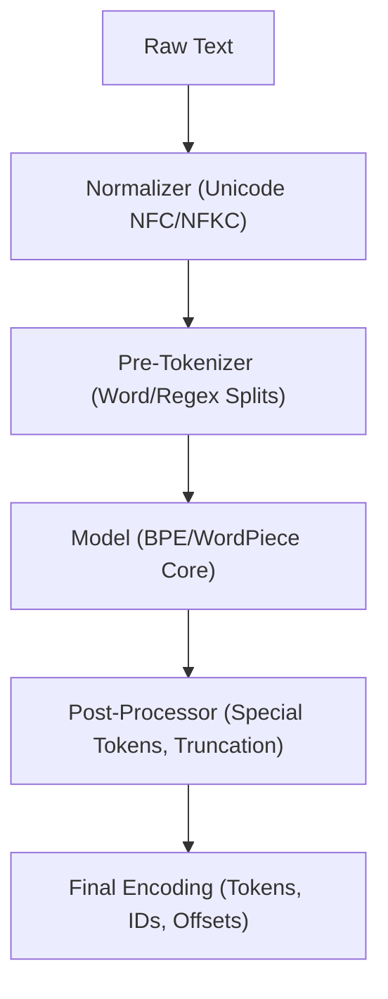

# Hugging Face Fast Tokenizers\n\n### Overview
Hugging Face's `tokenizers` library provides high-performance, Rust-backed tokenization pipelines with bindings for Python and Node.js.

### Key Features
* **GIL-Free Parallelism**: Processes large batches of text concurrently in Rust, bypassing the Python Global Interpreter Lock (GIL).
* **Alignment Tracking**: Maintains exact mappings (offsets) between token indices and the original string character spans, crucial for tasks like Named Entity Recognition (NER).

### Diagram: Hugging Face Pipeline

### Back-link
[← Back to README](../README.md)
