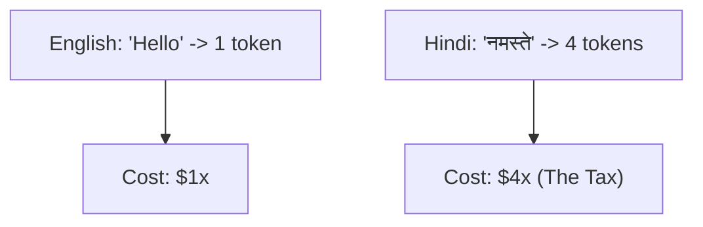

# The Multilingual Token Tax\n\n### Overview
The Multilingual Token Tax refers to the performance and financial penalty imposed on non-English speakers due to English-biased tokenizers.

### The Problem
* Most vocabularies are built on English-heavy datasets.
* Non-English text fragments into many more tokens than English equivalent text (high token fertility).
* Since API billing and model context windows are measured in tokens, non-English users face higher costs and shorter effective context lengths.

### Diagram: Token Fertility Comparison
```mermaid
barLink
    chart [English: 2 tokens] vs [Hindi/Korean: 8 tokens]
```


### Back-link
[← Back to README](../README.md)
