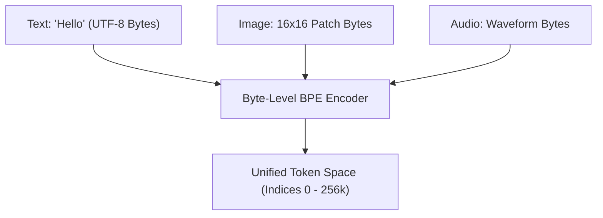

# Native Multimodal Byte Era (~2024–Present)\n\n### Overview
Modern frontier AI models (like Gemini, GPT-4o) have transitioned to Native Multimodal Byte streams. Instead of using text-specific tokenizers, they use Byte-Level BPE (BBPE) or direct raw-byte stream encoding, unifying text, image pixels, and audio waves into a single mathematical vector space.

### Key Concepts
1. **Byte-Level BPE (BBPE)**:
   * Vocabulary is initialized with the 256 basic byte values.
   * Any UTF-8 character or raw binary data can be represented as bytes, eliminating character-based UNK tokens.
2. **Unified Vocabulary**:
   * Text characters, image patch coordinates, and audio spectral codes map directly to the same token space.

### Diagram: Unified Multimodal Byte Stream

### Back-link
[← Back to README](../README.md)
