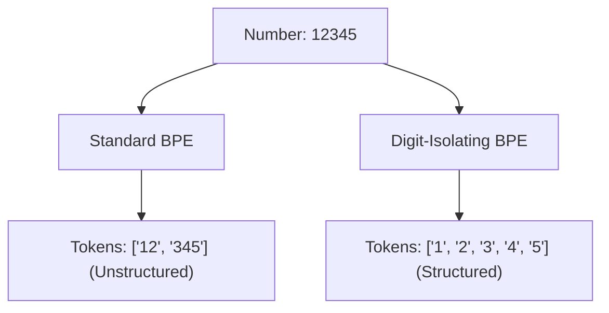

# The Number & Code Fragmentation Bug\n\n### Overview
Number and Code Fragmentation occurs when tokenizers split numbers or code indentation inappropriately, leading to mathematical and syntactic errors.

### Problems
1. **Mathematical Reasoning**: "10000" might split into "10" + "000", preventing the model from recognizing base-10 positional patterns.
2. **Code Syntax**: Indentation levels (e.g., Python tabs/spaces) get split unevenly, causing syntax errors in model-generated code.

### Mitigations
* Strict regex splits that force digits to be kept separate or grouped consistently.
* Indentation space characters represented as atomic tokens (e.g., `    ` = 1 token).

### Diagram: Number Tokenization Comparison

### Back-link
[← Back to README](../README.md)
