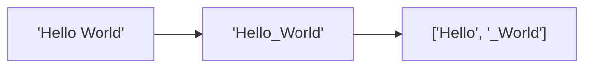

# SentencePiece (Language-Independent)\n\n### Overview
SentencePiece is an open-source tokenization library developed by Google. It treats input text as a raw byte stream, processing spaces as a native visible character (represented as `_`).

### Key Features
* **Whitespace Preservation**: Whitespace is replaced with `_` before BPE/Unigram modeling. This allows lossless de-tokenization.
* **Language Agnostic**: No language-dependent pre-tokenization is required, making it highly effective for languages without space separation (e.g., Chinese, Japanese, Thai).

### Diagram: SentencePiece Processing

### Back-link
[← Back to README](../README.md)
