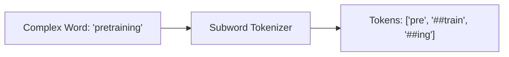

# Subword Compression Era (The Transformer Rise, ~2018–2024)\n\n### Overview
The Subword Compression Era bridged the gap between word-level and character-level tokenization. It uses data-driven algorithms to statistically compress text into variable-length subword units, ensuring zero OOV tokens while maintaining compact sequence lengths.

### Key Concepts
1. **Hybrid Granularity**:
   * Common words (e.g., "the", "and") are kept as single tokens.
   * Rare or complex words are split into frequent subword units (e.g., "unbelievable" -> "un" + "believ" + "able").
2. **Key Algorithms**:
   * **Byte-Pair Encoding (BPE)**: Frequency-based merging.
   * **WordPiece**: Likelihood-maximization merging.
   * **Unigram**: Top-down vocabulary pruning.

### Diagram: Subword Parsing

### Back-link
[← Back to README](../README.md)
