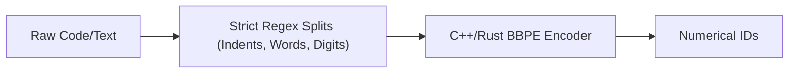

# Tiktoken (High-Throughput Regex BBPE)\n\n### Overview
Tiktoken is OpenAI's highly optimized, multi-threaded C++ implementation of Byte-Level BPE (BBPE). It is designed to maximize throughput during training and inference.

### Key Features
* **Regex Pre-Tokenization**: Tiktoken applies strict regex rules to prevent spaces, numbers, and punctuation from merging across lines or semantic blocks.
* **Fast C++ Engine**: Leverages native multithreading to speed up encoding by 10-100x compared to standard Python BPE implementations.

### Diagram: Tiktoken Architecture

### Back-link
[← Back to README](../README.md)
