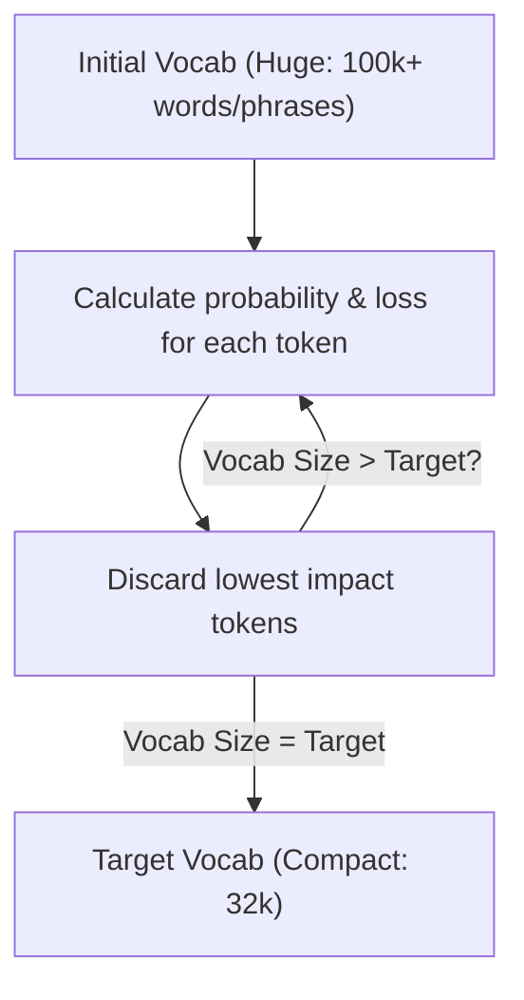

# Unigram Language Model Tokenization\n\n### Overview
Unigram Language Model Tokenization is a top-down subword tokenization algorithm used in SentencePiece, T5, and ALBERT.

### Algorithmic Steps
1. Initialize a massive vocabulary with all words and frequent substrings in the corpus.
2. Train a unigram language model on the corpus using the current vocabulary.
3. Compute the loss (relative entropy change) if each token were removed from the vocabulary.
4. Prune the lowest-scoring tokens (e.g., top 10-20% least useful).
5. Repeat steps 2–4 until the vocabulary shrinks to the target size.

### Diagram: Unigram Top-Down Pruning

### Back-link
[← Back to README](../README.md)
