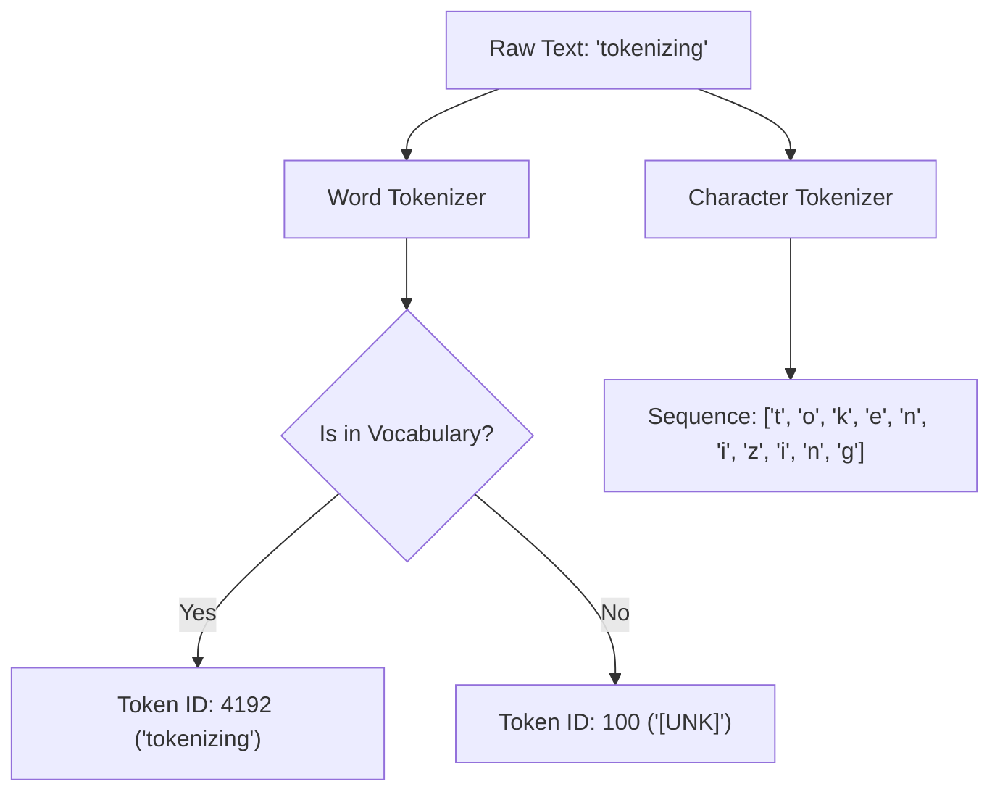

# Word & Character Splitting Era (Traditional NLP, Pre-2018)\n\n### Overview
The Word & Character Splitting Era represents the traditional paradigm of text preprocessing in Natural Language Processing (NLP). Before statistical subword models, researchers relied on rule-based systems or character-level representations.

### Key Concepts
1. **Word-Level Tokenization**:
   * Relies on whitespace splitting or punctuation-based heuristics (e.g., regex, NLTK's word_tokenize, SpaCy's rules).
   * **The Out-of-Vocabulary (OOV) Crisis**: Unseen words (typos, named entities, newly coined terms) are mapped to a generic `[UNK]` token, resulting in severe information loss.
   * Large vocabulary sizes (often 500k+ words) required to achieve reasonable coverage, inflating the weight matrices of neural models.

2. **Character-Level Tokenization**:
   * Decomposes all text into single characters (letters, numbers, punctuation).
   * Eliminates the OOV crisis completely since any word is a sequence of base characters.
   * **Sequence Inflation**: Drastically increases the sequence lengths (e.g., a 100-word paragraph becomes 500+ character tokens), which slows down RNNs/LSTMs due to quadratic attention complexity or sequential bottlenecks.

### Diagram: Tokenization Approaches

### Back-link
[← Back to README](../README.md)
