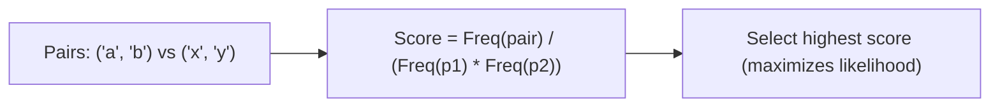

# WordPiece\n\n### Overview
WordPiece is a subword tokenization algorithm used in BERT and DistilBERT. While similar to BPE, it optimizes a different criteria when merging adjacent tokens.

### Key Differences from BPE
* **Merging Criteria**: Rather than selecting the most frequent pair, WordPiece selects the pair that maximizes the likelihood of the training data according to a unigram language model.
* **Notation**: WordPiece uses a special prefix (like `##` in Hugging Face implementation) to denote that a subword token is a suffix or continuation of a word rather than the start.

### Diagram: WordPiece Likelihood Optimization

### Back-link
[← Back to README](../README.md)
